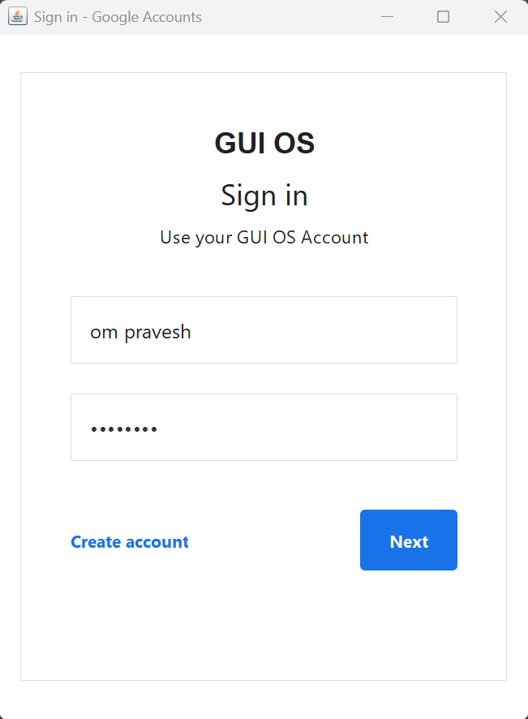
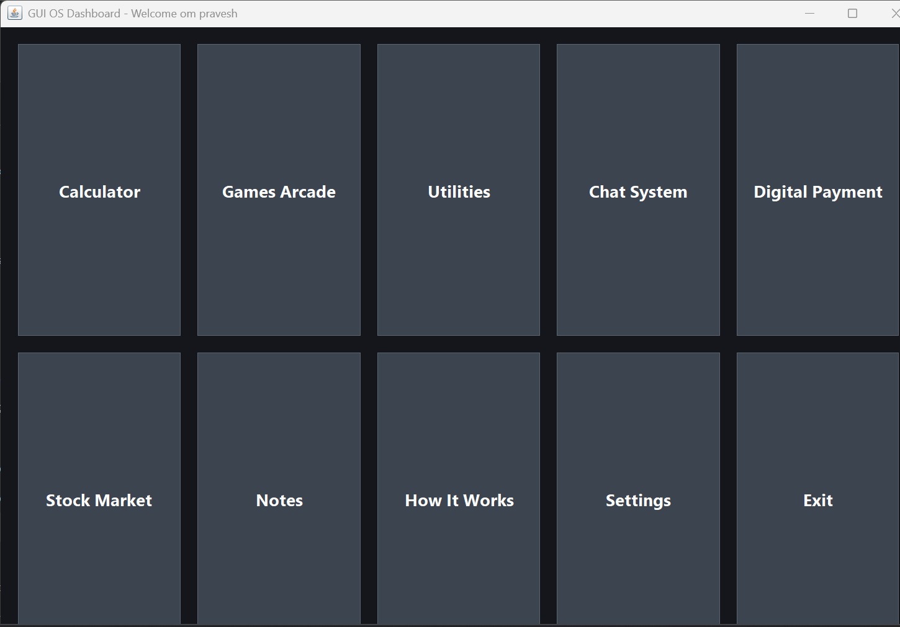
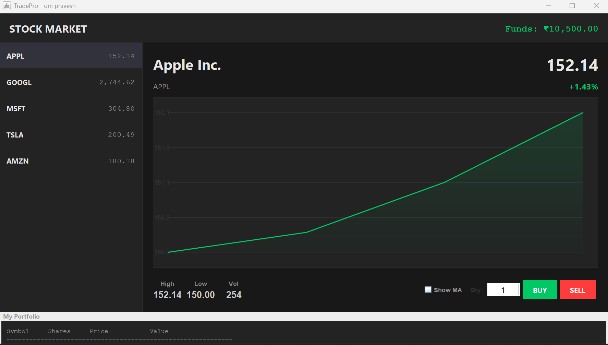
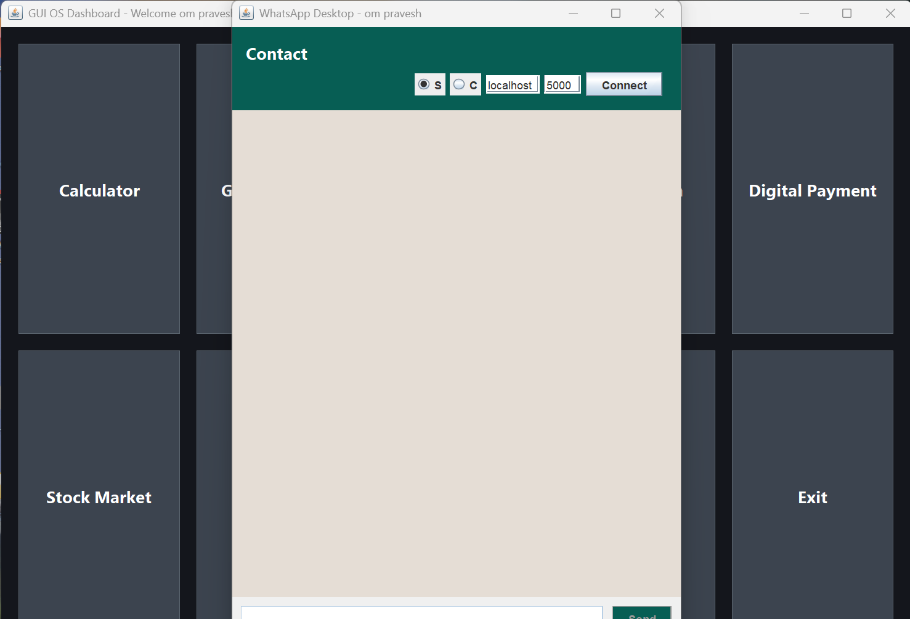
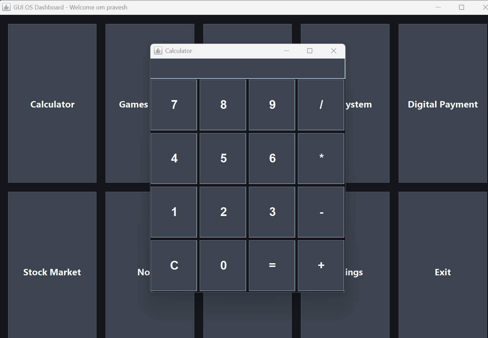
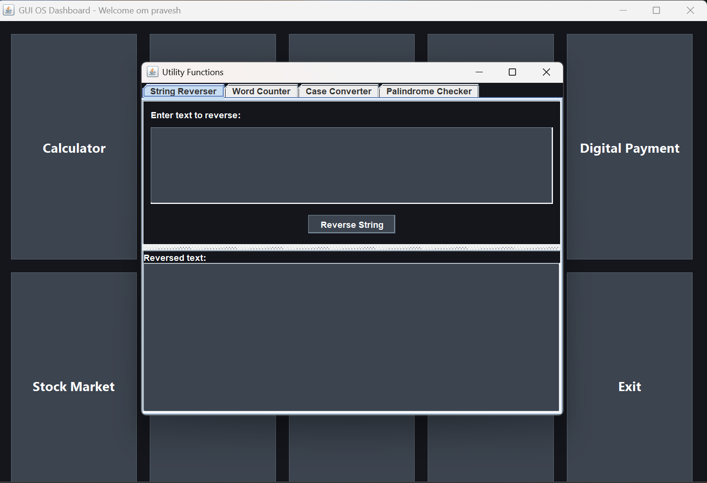
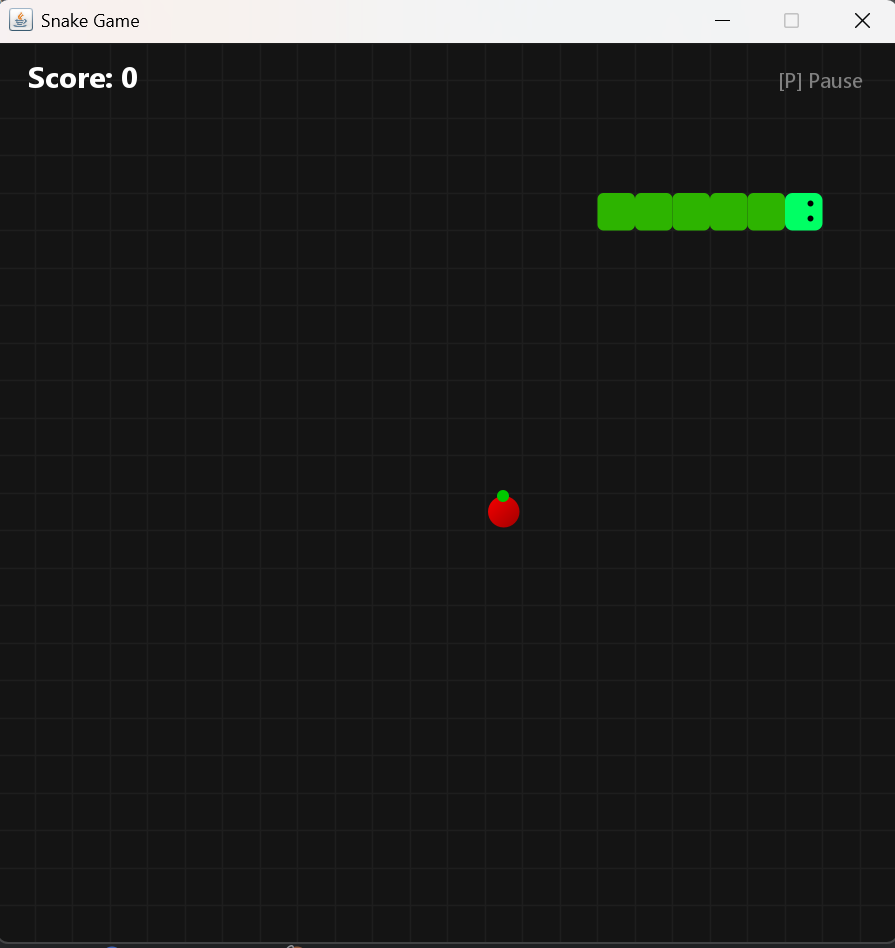
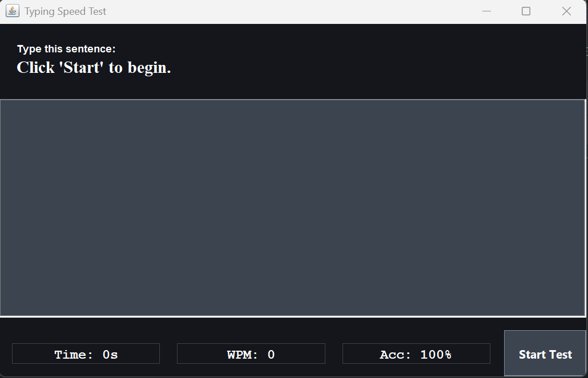
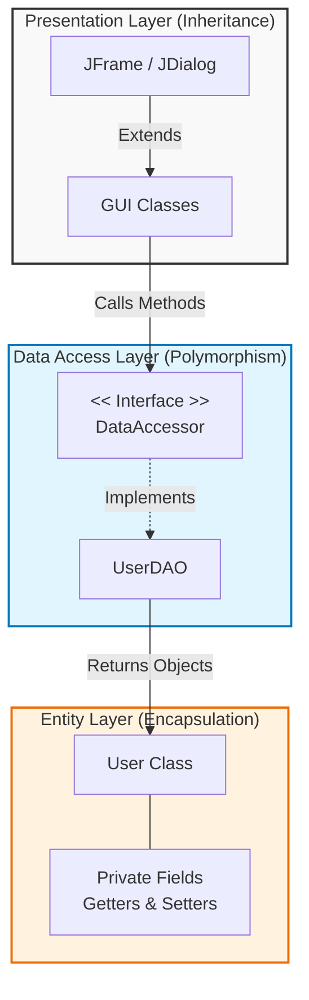

# third-semester-java-project-os-Operating-System-
GUI OS is a Java Swing–based desktop operating system simulation featuring multiple integrated applications, database connectivity, and interactive games. The project showcases core Java concepts such as Object-Oriented Programming, JDBC-based database integration, multithreading, and rich GUI development.

## Key Features

### Core System
- **User Authentication System** with MySQL database backend
- **Dashboard Interface** with application launcher
- **Theme Manager** supporting multiple color schemes (Dark, Light, Cyberpunk, Ocean)
- **Database Utilities** with transaction management

### Applications Suite
- **Digital Payment System** - PayPal-style interface with transaction history
- **Stock Market Simulator** - Real-time stock graphs and portfolio management
- **Chat Application** - Peer-to-peer messaging system
- **Notes App** - File-based note taking with CRUD operations
- **Calculator** - Basic arithmetic operations
- **Utilities** - String manipulation tools (reverser, counter, case converter)
- **How It Works** - System documentation viewer

### Games Collection
- **DOOM Brick Edition** - 3D raycaster game with shooting mechanics
- **Snake Game** - Classic snake with modern graphics
- **Adventure Quest** - Text-based RPG with multiple story paths
- **Typing Speed Test** - WPM and accuracy measurement
- **Rock Paper Scissors** & **Number Guessing** - Mini games

##  Technology Stack

- **Language**: Java 8+
- **GUI Framework**: Java Swing
- **Database**: MySQL with JDBC
- **Architecture**: MVC Pattern with DAO Layer
- **Build Tool**: Maven/Gradle (implied)
- **Version Control**: Git

##  Project Structure

```
src/
├── main/                 # Application entry point
├── model/               # Data models (User, Stock, Transaction)
├── dao/                 # Data Access Objects (UserDAO, TransactionDAO)
├── service/             # Business logic (NotesApp)
├── util/                # Utilities (DatabaseUtil, ThemeManager)
└── gui/
    ├── auth/            # Authentication GUI
    ├── apps/            # Main applications
    ├── games/           # Game implementations
    └── components/      # Reusable GUI components
```
<div align="center">

### Login & Dashboard
<table>
  <tr>
    <td align="center">
      <br>
      <b>Login Screen</b>
    </td>
    <td align="center">
      <br>
      <b>Dashboard</b>
    </td>
  </tr>
</table>

### Applications
<table>
  <tr>
    <td align="center">
      <br>
      <b>Stock Market</b>
    </td>
    <td align="center">
      <br>
      <b>Chat Application</b>
    </td>
  </tr>
  <tr>
    <td align="center">
      <br>
      <b>Calculator</b>
    </td>
    <td align="center">
      <br>
      <b>Utilities</b>
    </td>
  </tr>
     <tr>
    <td align="center">
      <br>
      <b>Sanke Game</b>
    </td>
    <td align="center">
      <br>
      <b>Type Speed Game</b>
    </td>
  </tr>
</table>

</div>

## Code Quality & Testing

### 1. **Object-Oriented Design Principles** (3 marks)
- **Encapsulation**: All model classes (User, Stock, Transaction) properly encapsulate data with private fields and public getters/setters
- **Inheritance**: Implemented through GUI component hierarchy and DAO interface (`DataAccessor<T>`)
- **Polymorphism**: Demonstrated through theme application system and game interfaces
- **Abstraction**: DAO pattern abstracts database operations from business logic

### 2. **Database Integration & Error Handling** (3 marks)
- **JDBC Implementation**: Full MySQL integration with connection pooling
- **Transaction Management**: Atomic money transfers with rollback capability
- **Prepared Statements**: SQL injection prevention throughout
- **Error Handling**: Comprehensive SQLException handling with user feedback
- **Database Schema**: Properly normalized tables with foreign key relationships

### 3. **Multithreading Implementation** (2 marks)
- **UI Responsiveness**: Database operations in separate threads
- **Game Animation**: Smooth game loops using Swing Timers and Threads
- **Real-time Updates**: Stock market simulation with concurrent price updates
- **Chat System**: Non-blocking socket communication

### 4. **Code Organization & Documentation** (2 marks)
- **Modular Structure**: Clean separation of concerns (MVC pattern)
- **Package Organization**: Logical grouping by functionality
- **Inline Comments**: Key algorithms and complex logic documented
- **Consistent Naming**: Follows Java naming conventions throughout

## Teamwork & Collaboration

### Team Members & Contributions

| Member | Role | Key Contributions |
|--------|------|-------------------|
| **Om Pravesh** (Team Admin) | Project Lead & Architect | - Overall system architecture design<br>- Database schema and JDBC implementation<br>- Payment system with transaction management<br>- Theme Manager and UI consistency<br>- Integration testing and bug fixes |
| **Diya** | GUI Developer & Game Programmer | - Complete Stock Market GUI with real-time graphs<br>- Adventure Quest RPG game implementation<br>- Calculator and Utilities applications<br>- Notes app with file system integration<br>- UI theme implementation and styling |
| **Urvi** | Game Developer & Tester | - DOOM Brick Edition 3D game with shooting mechanics<br>- Snake game with modern graphics and animations<br>- Typing Speed Test application<br>- Rock Paper Scissors and Number Guessing games<br>- Comprehensive application testing and debugging |

### Collaboration Process
1. **Version Control**: Used Git with feature branching strategy
2. **Code Reviews**: Regular peer reviews before merging to main branch
3. **Task Allocation**: Assigned based on expertise and interest areas
4. **Integration Meetings**: Weekly sync-ups to resolve dependencies
5. **Documentation**: Shared understanding of interfaces and APIs

### Evidence of Collaboration
- Consistent coding style across all modules
- Shared utility classes (DatabaseUtil, ThemeManager)
- Integrated application launch system from single dashboard
- Unified error handling and user feedback mechanisms

## Innovation & Extra Effort

### 1. **Advanced Graphical Features**
- **Real-time Stock Graphs**: Interactive candlestick-style graphs with moving averages
- **3D Raycasting Engine**: Custom-built DOOM-style rendering without external libraries
- **Animated UI Elements**: Smooth transitions and visual feedback throughout
- **Multiple Theme Support**: Dynamic theme switching affecting all applications

### 2. **Integrated Application Ecosystem**
- **Cross-application Data Sharing**: User balance updates reflected across payment and stock apps
- **Unified Authentication**: Single sign-on with session management
- **Consistent UI/UX**: Common design language across all applications
- **File System Integration**: Notes app with user-specific file management

### 3. **Educational Value**
- **Architecture Documentation**: "How It Works" application explains system design
- **Design Patterns Demonstrated**: MVC, DAO, Singleton, Observer patterns
- **Database Transactions**: Practical demonstration of ACID properties
- **Multithreading Examples**: Real-world concurrency patterns

## Installation & Setup

### Prerequisites
1. Java JDK 8 or higher
2. MySQL Server 5.7+
3. MySQL JDBC Connector

### Setup Instructions
1. Clone the repository:
   ```bash
   git clone https://github.com/your-username/gui-os-java.git
   ```

2. Import the project into your favorite IDE (Eclipse/IntelliJ)

3. Configure MySQL database:
   ```sql
   CREATE DATABASE project;
   CREATE USER 'root'@'localhost' IDENTIFIED BY 'gtaomp23';
   GRANT ALL PRIVILEGES ON project.* TO 'root'@'localhost';
   FLUSH PRIVILEGES;
   ```

4. Update database credentials in `DatabaseUtil.java` if needed

5. Add MySQL JDBC driver to classpath

6. Run `JavaGuiOs.main()` to start the application

## Database Schema

```sql
CREATE TABLE users (
    username VARCHAR(50) PRIMARY KEY,
    password VARCHAR(100) NOT NULL,
    balance DOUBLE NOT NULL
);

CREATE TABLE transactions (
    id INT AUTO_INCREMENT PRIMARY KEY,
    sender VARCHAR(50) NOT NULL,
    recipient VARCHAR(50) NOT NULL,
    amount DOUBLE NOT NULL,
    timestamp TIMESTAMP DEFAULT CURRENT_TIMESTAMP
);
```

## How to Use

1. **Launch Application**: Run `JavaGuiOs` class
2. **Login**: Use default credentials or register new account
3. **Explore Dashboard**: Click on application icons to launch
4. **Try Features**:
   - Transfer money in Payment System
   - Buy/sell stocks in Stock Market
   - Play games in Arcade Menu
   - Chat with peers (requires two instances)
   - Change themes in Settings

## Future Enhancements

1. **Database Encryption**: Secure sensitive user data
2. **Network Multiplayer**: Online gaming features
3. **Plugin System**: Third-party application support
4. **Mobile Compatibility**: Responsive design for tablets
5. **Analytics Dashboard**: Usage statistics and reporting

## Academic Justification

This project fulfills all requirements for a comprehensive Java programming assessment:
- **Object-Oriented Programming**: Full implementation of OOP principles
- **Database Connectivity**: Complete JDBC integration with MySQL
- **GUI Development**: Extensive Swing-based interface
- **Multithreading**: Responsive UI with background processing
- **Software Engineering**: Proper design patterns and architecture

## Acknowledgments

- **Team**: Diya, Urvi, and Om Pravesh for collaborative development
- **Instructors**: For guidance on Java programming concepts
- **Open Source Community**: For inspiration and learning resources

---


## Table of contents

* [Project overview](#project-overview)
* [Repository structure](#repository-structure)
* [Prerequisites](#prerequisites)
* [Configure database credentials](#configure-database-credentials)
* [Add MySQL Connector/J (JDBC) to project](#add-mysql-connectoj-to-project)

  * [IntelliJ IDEA](#intellij-idea)
  * [Command line / Manual](#command-line--manual)
  * [Maven (recommended)](#maven-recommended)
  * [Gradle](#gradle)
* [Build and run](#build-and-run)

  * [Run from IntelliJ](#run-from-intellij)
  * [Run from command line (javac/java)](#run-from-command-line-javacjava)
  * [Create runnable JAR (fat/uber JAR)](#create-runnable-jar-fatuber-jar)
* [Database initialization & schema](#database-initialization--schema)
* [Notes & troubleshooting](#notes--troubleshooting)
* [Useful files / screenshots](#useful-files--screenshots)

---

## Prerequisites

* Java JDK 11+ installed (JDK 17 or later recommended).
* MySQL server (or remote MySQL-compatible service) OR a free hosted DB (we have used `freesqldatabase.com` in the code example).
* MySQL Connector/J (JDBC) JAR.
* (Optional) IntelliJ IDEA or other Java IDE.

---

## Configure database credentials

Open `DatabaseUtil` in the source and update these fields for your environment:

```java
private static final String DB_URL = "jdbc:mysql://HOST:3306/DATABASE_NAME";
private static final String DB_USER = "your_db_username";
private static final String DB_PASS = "your_db_password";
```

If you use a remote/hosed DB, include the host name and correct port. If using MySQL 8+ ensure you use the `com.mysql.cj.jdbc.Driver` and `jdbc:mysql://...` (the code uses `com.mysql.cj.jdbc.Driver`).

> Security tip: Do not commit plaintext credentials into public repos. Consider using environment variables (see below).

### Use environment variables (safer)

Modify `getConnection()` or add helper to read env vars:

```java
String url = System.getenv().getOrDefault("JDBC_URL", DB_URL);
String user = System.getenv().getOrDefault("JDBC_USER", DB_USER);
String pass = System.getenv().getOrDefault("JDBC_PASS", DB_PASS);
DriverManager.getConnection(url, user, pass);
```

Then run with:

```bash
export JDBC_URL="jdbc:mysql://localhost:3306/mydb"
export JDBC_USER="me"
export JDBC_PASS="secret"
java -cp ".:lib/mysql-connector-j-9.5.0.jar" JavaGuiOs
```

---

## Add MySQL Connector/J (JDBC) to project

You must make the MySQL JDBC driver available on the classpath at compile-time and run-time.

### IntelliJ IDEA

1. `File` → `Project Structure...` → `Libraries` → `+` → add the `mysql-connector-j-<version>.jar` from your `lib/` or downloaded location.
2. Or add it to `Module` → `Dependencies` so it appears under **External Libraries** (you already have `mysql-connector-j-9.5.0` visible in the screenshot).
3. Rebuild project and run.

### Command line / Manual

1. Download the driver: [https://dev.mysql.com/downloads/connector/j/](https://dev.mysql.com/downloads/connector/j/)
2. Place `mysql-connector-j-<version>.jar` into your project's `lib/` folder.
3. Compile & run with the jar on the classpath (examples below).

### Maven (recommended for dependency management)

Add to `pom.xml` dependencies:

```xml
<dependencies>
  <dependency>
    <groupId>mysql</groupId>
    <artifactId>mysql-connector-j</artifactId>
    <version>9.0.0</version>
  </dependency>
</dependencies>
```

Then `mvn package` and use the Maven exec plugin or build a shaded (uber) jar.

### Gradle

Add to `build.gradle`:

```gradle
dependencies {
  implementation 'mysql:mysql-connector-j:9.0.0'
}
```

---

## Build and run

Below are the common ways to run the project.

### Run from IntelliJ

1. Ensure `mysql-connector-j` is added as a library/dependency.
2. Open `JavaGuiOs.java` and run the `main` method (green ▶ icon).
3. When prompt appears in console, enter username/password, or let it create a new account.

### Run from command line (javac/java)

Assume:

* `src/JavaGuiOs.java` (single-file for simplicity)
* `lib/mysql-connector-j-9.5.0.jar`

Compile:

```bash
javac -d out -cp lib/mysql-connector-j-9.5.0.jar src/JavaGuiOs.java
```

Run (Linux/macOS):

```bash
java -cp "out:lib/mysql-connector-j-9.5.0.jar" JavaGuiOs
```

Run (Windows PowerShell/CMD):

```powershell
java -cp "out;lib\mysql-connector-j-9.5.0.jar" JavaGuiOs
```

If your main class is in a package, use the fully-qualified class name (e.g. `com.example.JavaGuiOs`).

### Create runnable JAR (fat/uber JAR)

If you want a single distributable JAR that includes the MySQL driver use the Maven Shade plugin, Gradle shadow plugin, or manually include the jar contents.

**Maven Shade example** (in `pom.xml`):

```xml
<build>
  <plugins>
    <plugin>
      <groupId>org.apache.maven.plugins</groupId>
      <artifactId>maven-shade-plugin</artifactId>
      <version>3.2.4</version>
      <executions>
        <execution>
          <phase>package</phase>
          <goals><goal>shade</goal></goals>
          <configuration>
            <transformers>
              <transformer implementation="org.apache.maven.plugins.shade.resource.ManifestResourceTransformer">
                <mainClass>JavaGuiOs</mainClass>
              </transformer>
            </transformers>
          </configuration>
        </execution>
      </executions>
    </plugin>
  </plugins>
</build>
```

After `mvn package`, run:

```bash
java -jar target/yourapp-shaded.jar
```

---

## Database initialization & schema

The code's `DatabaseUtil.initializeDatabase()` will run the following statements (so you normally do not need to run them manually):

```sql
CREATE TABLE IF NOT EXISTS users (
  username VARCHAR(50) PRIMARY KEY,
  password VARCHAR(100) NOT NULL,
  balance DOUBLE NOT NULL
);

CREATE TABLE IF NOT EXISTS transactions (
  id INT AUTO_INCREMENT PRIMARY KEY,
  sender VARCHAR(50) NOT NULL,
  recipient VARCHAR(50) NOT NULL,
  amount DOUBLE NOT NULL,
  timestamp TIMESTAMP DEFAULT CURRENT_TIMESTAMP
);
```

If you prefer to create the schema manually, run the SQL above on your MySQL instance. Make sure the DB user you provide has `CREATE`, `SELECT`, `INSERT`, `UPDATE`, `DELETE` privileges for the database.

---

## Notes & troubleshooting

* **Driver not found**: If you see `MySQL Driver not found. Ensure JDBC connector is in classpath` check that the connector jar is on your runtime classpath. In IDE add it as library; in command line include `-cp lib/mysql-connector-j-*.jar`.
* **Access denied**: Confirm DB user, password and host allow remote connections (and that your host firewall / DB server accept remote access).
* **Timezone / auth errors**: For newer MySQL, include `?serverTimezone=UTC&useSSL=false` or similar in JDBC URL if needed:

  ```text
  jdbc:mysql://host:3306/dbname?serverTimezone=UTC&useSSL=false
  ```
* **Port conflicts**: The chat server uses sockets (default 5000 in UI). Use a free port or run only one instance of server mode.
* **Threading**: DB calls in the UI are done on separate threads in the code. If you modify code ensure long-running DB ops remain off the EDT.

---

## Useful files / screenshots

Project screenshots (these were uploaded to the session):

* `/mnt/data/2c40a523-a50c-4abe-98b9-0c499c0be9da.png`
* `/mnt/data/d834069a-42a4-41b0-a698-55fbdd58bbbc.png`
* `/mnt/data/8f6ad09d-e68d-423f-a169-936773a6f2fb.png`
* `/mnt/data/74305148-6447-44ab-8c00-25aa42e1b20a.png`
* `/mnt/data/e74a36b5-bf7e-41c4-8050-3ee671bdd366.png`

---

## Quick start (summary)

1. Put `mysql-connector-j-<version>.jar` into `lib/` or add dependency via Maven/Gradle.
2. Update DB credentials in `DatabaseUtil` or export env vars.
3. Compile & run (`javac` / `java` or use IDE).
4. When the app starts, log in using console prompt — a new user will be created automatically if not found.

---

If you want, I can:

* Split `JavaGuiOs.java` into packages and multiple files (models, dao, ui) and provide a `pom.xml` or `build.gradle` with the right dependency versions and a runnable packaging configuration.
* Prepare a small `pom.xml` for Maven with the Shade plugin so you can build a single jar.


---

## OOP Implementation

### Flowchart: OOP Structure




### **Object-Oriented Programming Excellence**

#### Polymorphism

```java
interface DataAccessor<T> {
    T read(String key) throws SQLException;
    T update(T entity) throws SQLException;
}
```

*Implementation: **`UserDAO implements DataAccessor<User>`*

#### Inheritance

* All GUI classes extend `JFrame` or `JDialog`
* Custom panels extend `JPanel`

#### Exception Handling

```java
try {
    DatabaseUtil.transferFunds(sender, recipient, amount);
} catch (SQLException ex) {
    JOptionPane.showMessageDialog(this, "Transaction failed!");
}
```

#### Encapsulation

```java
class User {
    private String username;
    private String password;
    private double balance;
    // Getters & Setters
}
```

---

##  Collections & Generics

### **Efficient Data Management**

#### Collections Framework

```java
private static final Map<String, User> activeUsers = new HashMap<>();
private final List<Double> priceHistory = new ArrayList<>();
private final Map<String, Stock> stocks = new LinkedHashMap<>();
```

#### Generics Implementation

```java
interface DataAccessor<T> {
    T read(String key) throws SQLException;
    T update(T entity) throws SQLException;
    List<T> findAll() throws SQLException;
}

class UserDAO implements DataAccessor<User>
```

---

##  Multithreading & Synchronization

### **Concurrent Operations**

#### Multithreading

```java
new Thread(() -> executeTransfer(recipient, amount)).start();
```

Real-time stock updates:

```java
feedTimer = new javax.swing.Timer(1200, e -> {
    if (!feedRunning) return;
    updatePricesStep();
});
```

#### Thread Safety

* `SwingUtilities.invokeLater()` for UI updates
* Separate threads for chat system networking
* Timer-based background tasks

---

##  Database Operations Classes

### **Robust Data Management**

#### Database Utility Class

```java
class DatabaseUtil {
    // Connection management + Transactions
}
```

#### DAO Pattern

```java
class UserDAO implements DataAccessor<User> {
    public User create(User user);
    public User read(String username);
    public User update(User user);
    public List<User> findAll();
}
```

#### Transaction Management

```java
conn.setAutoCommit(false);
// Execute operations
conn.commit();
```

---

##  JDBC Connectivity

### **Database Integration**

#### JDBC Setup

```java
public static Connection getConnection() throws SQLException {
    Class.forName("com.mysql.cj.jdbc.Driver");
    return DriverManager.getConnection(DB_URL, DB_USER, DB_PASS);
}
```

#### Prepared Statements

```java
String sql = "INSERT INTO users (username, password, balance) VALUES (?, ?, ?)";
PreparedStatement stmt = conn.prepareStatement(sql);
```

---

##  Application Showcase – Stock Market

### **Real-time Financial Simulation**

Features:

* Live stock price updates
* Interactive buy/sell actions
* Portfolio tracking
* Real-time graph rendering

Technical Highlights:

* Custom `StockGraphPanel`
* Timer-based updates
* Collections for history storage

---

##  Application Showcase – Digital Payment

### **Secure Transaction System**

* Atomic transactions
* Transaction history
* Real-time balance updates

```java
DatabaseUtil.transferFunds(sender, recipient, amount);
```

---

##  Application Showcase – Chat System

### **Network Communication**

Features:

* Client/Server architecture
* Real-time messaging
* Threaded message handling

Implementation:

* `ServerSocket` & `Socket`
* Background threads
* `SwingWorker`

---

##  Games & Utilities

### **Diverse App Suite**

Games:

* Snake
* Typing Speed Test
* RPG Adventure
* Rock Paper Scissors
* Number Guessing

Utilities:

* Calculator
* Notes App (File I/O)
* String utilities

---

##  Theme Management System

### **Dynamic UI Customization**

```java
enum ColorScheme { DARK, LIGHT, CYBER, OCEAN }
```

* Runtime theme switching
* Font scaling
* Consistent global appearance

---

##  Architecture Overview

### **System Design**

Components:

* Core Framework
* DAO/Data Layer
* Application Layer
* Theme Engine

Patterns Used:

* Singleton
* DAO
* MVC

---

##  Code Quality & Best Practices

### **Professional Standards**

✔ Clean Package Structure ✔ Exception Handling ✔ Documentation & Comments ✔ Modular Code

---

##  Demonstration

### **Live Demo Includes:**

* Login → Dashboard
* Stock Market
* Digital Payments
* Chat Communication
* Games
* Theme Switch

---

*This project was developed as part of an academic curriculum to demonstrate comprehensive Java programming skills, database integration, and software engineering principles.*

---


## 🙏 Thank You!

